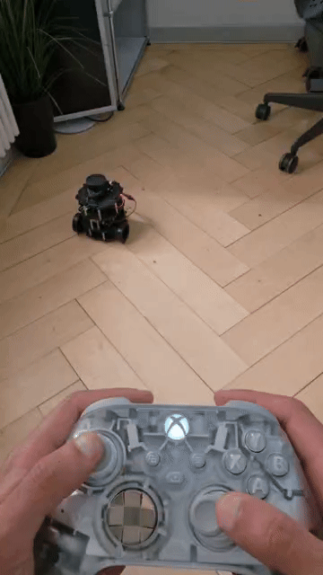
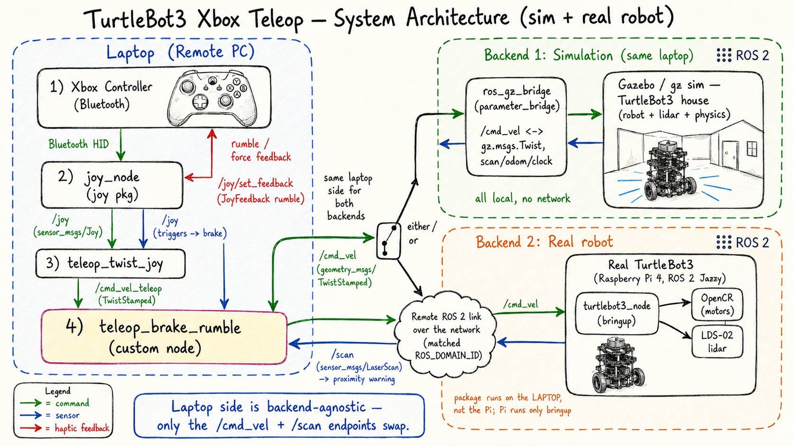
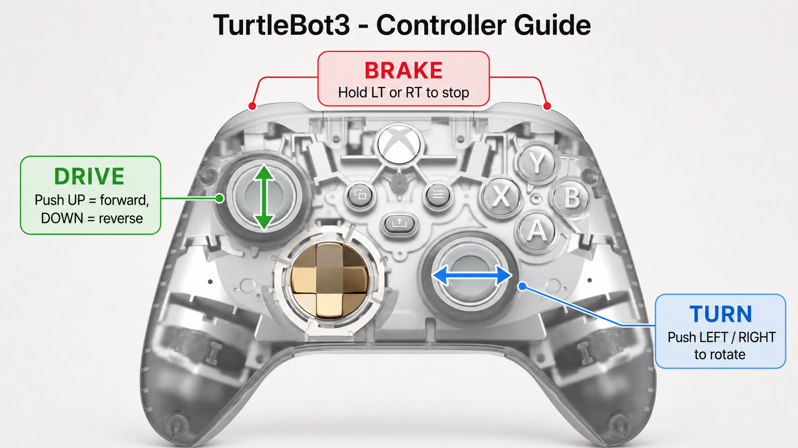

# tb3_xbox_teleop

ROS 2 package for driving a TurtleBot3 in Gazebo with a Bluetooth Xbox controller. It provides split-stick control, an LT/RT brake, speed-adaptive controller rumble, and an optional lidar proximity warning. It targets ROS 2 Jazzy and the new Gazebo (`gz sim`), and uses the TurtleBot3 house world.

The repository is a colcon workspace; the package is in `src/tb3_xbox_teleop`.

## Demo

Real robot:



Simulated robot:


## Architecture



The teleop stack runs entirely on the laptop and is independent of the target. It publishes `/cmd_vel` (`TwistStamped`) and subscribes to `/scan` (`LaserScan`); only those two endpoints differ between targets.

- Simulation: `ros_gz_bridge` and `gz sim` (the TurtleBot3 house), running locally.
- Real robot: a remote ROS 2 connection over the network with a matching `ROS_DOMAIN_ID`. The robot runs only `turtlebot3_bringup`, and this package stays on the laptop.

## Controls



| Control | Action |
|---|---|
| Left stick up/down | Drive forward and back (max 0.22 m/s, the real Burger limit) |
| Right stick left/right | Turn (max 2.84 rad/s) |
| LT or RT (hold) | Brake: stop the robot; rumble goes silent |
| Rumble | Low-frequency vibration proportional to speed, silent when stopped |
| Rumble (proximity, opt-in) | Increases as the robot approaches an obstacle |

## Prerequisites

ROS 2 Jazzy on Ubuntu 24.04, and a Bluetooth Xbox controller.

Install the required packages:

```bash
sudo apt update
sudo apt install \
  ros-jazzy-turtlebot3-gazebo \
  ros-jazzy-joy \
  ros-jazzy-teleop-twist-joy
```

`ros-jazzy-turtlebot3-gazebo` pulls in the TurtleBot3 worlds and models, `ros_gz`, and `gz sim`. `ros-jazzy-joy` provides `joy_node` and its `/joy/set_feedback` rumble interface, and `ros-jazzy-teleop-twist-joy` maps the joystick to a Twist. Force feedback works through the in-kernel controller driver, so no extra package is needed for the rumble.

Pair the controller over Bluetooth:

```bash
bluetoothctl
# at the bluetoothctl prompt:
power on
agent on
default-agent
scan on
# hold the controller's pair button until the Xbox button flashes quickly,
# read its MAC address from the scan output, then:
pair <MAC>
trust <MAC>
connect <MAC>
scan off
exit
```

Confirm the controller is present as a joystick device:

```bash
ls /dev/input/js0
```

## Build

```bash
git clone https://github.com/prakash-aryan/tb3_xbox_teleop.git ~/tb3_xbox_teleop
cd ~/tb3_xbox_teleop
colcon build
source install/setup.bash
```

## Run

### Simulation

A single command starts the TurtleBot3 house simulation and the teleop stack:

```bash
export TURTLEBOT3_MODEL=burger
ros2 launch tb3_xbox_teleop bringup.launch.py                  # sim + teleop
ros2 launch tb3_xbox_teleop bringup.launch.py proximity:=true  # sim + teleop, with lidar warning
```

### Real robot

Start `turtlebot3_bringup` on the robot, and make sure the laptop is on the same ROS 2 graph as the robot (a matching `ROS_DOMAIN_ID` and a DDS transport that reaches it). Then run the teleop stack on its own:

```bash
export TURTLEBOT3_MODEL=burger
ros2 launch tb3_xbox_teleop teleop.launch.py                  # teleop only
ros2 launch tb3_xbox_teleop teleop.launch.py proximity:=true  # teleop only, with lidar warning
```

### Launch files

- `bringup.launch.py` starts the house simulation and the teleop stack.
- `sim.launch.py` starts the house simulation only (gz sim, robot spawn, ros_gz bridge).
- `teleop.launch.py` starts the teleop stack only, for use with the real robot or a separately started simulation.

The teleop stack consists of three nodes:

- `joy_node` reads the controller at `/dev/input/js0`.
- `teleop_twist_joy` maps the sticks to `/cmd_vel_teleop` (a stamped Twist).
- `teleop_brake_rumble` forwards to `/cmd_vel`, applies the brake, and drives the rumble.

The lidar proximity warning is disabled by default. It is controlled by the node parameter `proximity_warning` (a boolean), which is exposed as the launch argument `proximity`. When enabled, the rumble increases as the robot approaches an obstacle: the front arc when driving forward and the rear arc when reversing, from about 0.8 m down to 0.2 m. It stays silent while the robot is stopped or only turning.

The node is also a standard executable: `ros2 run tb3_xbox_teleop teleop_brake_rumble`.

## Notes

- The TurtleBot3 Gazebo bridge subscribes to `geometry_msgs/msg/TwistStamped`, so teleop runs with `publish_stamped_twist:=true`. A plain `Twist` does not move the robot.
- Bluetooth Xbox axis map: left stick X and Y are axes 0 and 1, right stick X is axis 2, and LT and RT are axes 4 and 5.
- The brake is a multiplexer. `teleop_twist_joy` publishes to `/cmd_vel_teleop`, and the node forwards that to `/cmd_vel` except while a trigger is held, when it publishes zero. This keeps the sticks and the brake from both publishing to `/cmd_vel`.
- Rumble is sent only when its value changes, not continuously, because heavy traffic over the Bluetooth HID link adds input latency. It uses the low-frequency motor only; the high-frequency motor is uncomfortable over long sessions.

## Controller reconnect

The controller sleeps after a few idle minutes, and `/dev/input/js0` disappears. To reconnect:

```bash
bluetoothctl connect <CONTROLLER_MAC>   # press the Xbox button to wake it first
```

Then relaunch so that `joy_node` reopens the device.

## Acknowledgments

This package builds on existing ROS 2 work:

- [`joy` and `teleop_twist_joy`](https://github.com/ros-drivers/joystick_drivers) from the ROS joystick_drivers project provide the joystick driver, the `/joy/set_feedback` rumble interface, and the joystick-to-Twist mapping.
- [TurtleBot3](https://github.com/ROBOTIS-GIT/turtlebot3) and [turtlebot3_simulations](https://github.com/ROBOTIS-GIT/turtlebot3_simulations) from ROBOTIS provide the robot model, the Gazebo bridge, and the house world.
